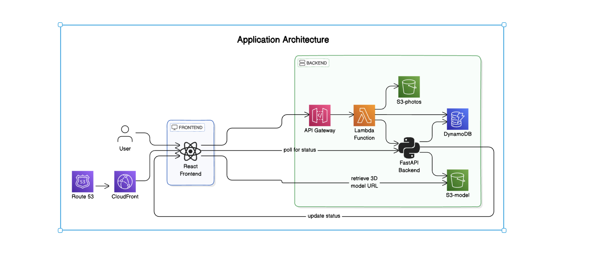

# 3D-Ready Web Application

3D-Ready is a web application that allows users to upload photos and generate high-fidelity 3D models of house interiors. This documentation provides an overview of the application's architecture, setup, and usage.

## Table of Contents

- [Overview](#overview)
- [Architecture](#architecture)
- [Frontend Setup](#frontend-setup)
- [Backend Setup](#backend-setup)
- [AWS Services](#aws-services)
- [Deployment](#deployment)
- [Usage](#usage)
- [Ideas Tried That Didn't Work Out](#ideas-tried-that-didnt-work-out)

## Overview

3D-Ready provides a complete end-to-end solution for generating and displaying 3D models from user-uploaded photos. It is optimized for the real estate industry to provide detailed 3D models of house interiors.

## Architecture

  

    
  

The application consists of the following components:

- **Frontend**: Built with React and hosted on AWS Amplify.
- **Backend**: Implemented using FastAPI, running on AWS.
- **AWS Services**: Utilizes AWS Lambda, S3, DynamoDB, API Gateway, and more.

## Frontend Setup

The frontend of the 3D-Ready application is built using React. Development was carried out using Google's Cloud Shell Editor, which provides a cloud-based integrated development environment requiring no local installations.

## Backend Setup

The backend of the 3D-Ready application is implemented using FastAPI. The backend setup includes running FastAPI with Gunicorn and managing the process using Supervisor for production readiness.

### FastAPI

FastAPI is used to create the RESTful API for the backend. It provides high performance. 3D-Ready's magic 3D model generator is sitting behind an API endpoint.

## AWS Services

The 3D-Ready application leverages various AWS services to ensure a scalable, reliable, and efficient workflow.

### S3

- **Amazon Simple Storage Service (S3)** is used for storing uploaded photos and the generated 3D models. It provides durable, scalable object storage with easy integration into the rest of the AWS ecosystem.

### DynamoDB

- **Amazon DynamoDB** stores metadata about the photos and 3D models. It offers fast and flexible NoSQL database services for any scale, ensuring low-latency access to metadata.

### Lambda

- **AWS Lambda** processes the uploaded photos and triggers the 3D model generation. It allows for running code without provisioning or managing servers, and scales automatically with the size of the workload.

### API Gateway

- **Amazon API Gateway** exposes the FastAPI endpoints to the frontend. It acts as a "front door" for the application to access data, business logic, or functionality from the backend services securely and reliably.

### Amplify

- **AWS Amplify** hosts the React frontend, providing a complete CI/CD pipeline. Amplify automatically detects changes in the source code, builds the project, and deploys it to a globally accessible URL.

### Route 53

- **Amazon Route 53** is used for domain name management. It provides highly available and scalable Domain Name System (DNS) web services, translating domain names into the IP addresses needed to route requests to the application.

### CloudFront

- **Amazon CloudFront** is a content delivery network (CDN) that distributes the frontend content globally with low latency and high transfer speeds. It caches the content at edge locations worldwide, ensuring fast delivery to users.

### Detailed Integration

- **S3 and CloudFront**: The static assets of the frontend hosted in S3 are distributed via CloudFront, ensuring low-latency access and high availability.
- **Route 53**: Custom domain names are managed through Route 53, which routes incoming requests to CloudFront distributions and API Gateway endpoints.
- **API Gateway and FastAPI**: API Gateway provides a unified interface for the FastAPI backend endpoints, handling request routing, throttling, and security.
- **Lambda and DynamoDB**: Lambda functions process the photos, generate the 3D models, and store the resulting metadata in DynamoDB, enabling efficient querying and retrieval by the frontend.

These services work together to provide a seamless and efficient workflow for the 3D-Ready application, ensuring high availability, scalability, and performance.

## Deployment

### Frontend Deployment

The application is hosted on AWS Amplify, utilizing its continuous deployment pipeline for seamless updates.

To set up the frontend, clone the repository within the Google Cloud Shell Editor, configure AWS Amplify for hosting, and push your changes. AWS Amplify automatically detects the changes, builds the project, and deploys it to the configured hosting environment.

### Backend Deployment

### Gunicorn

Gunicorn (Green Unicorn) is a Python WSGI HTTP server for UNIX. It is used to serve the FastAPI application in a production environment. Gunicorn handles multiple requests simultaneously, providing robust performance and scalability.

### Supervisor

Supervisor is a process control system that allows for monitoring and controlling processes on UNIX-like operating systems. It ensures that the FastAPI application, served by Gunicorn, runs continuously and restarts automatically if it crashes. Supervisor also facilitates log collection for troubleshooting.

## Usage

1. Navigate to the deployed frontend URL.
2. Upload photos through the interface.
3. The backend processes the photos and generates a 3D model.
4. The frontend polls for the status of the 3D model generation every 10 seconds.
5. Once the model is ready, the frontend displays the 3D model URL.

## Ideas Tried That Didn't Work Out

During the development of the 3D-Ready application, we explored several approaches to optimize and scale the backend processing. One notable approach involved building a Docker image for the FastAPI application and pushing it to AWS Container Registry for use with AWS SageMaker. The goal was to leverage SageMaker's powerful machine learning capabilities for 3D model generation.

However, we encountered size limitations with the Docker image, which prevented us from deploying it effectively via SageMaker. The image size exceeded the allowable limits, leading to issues with deployment and scalability. As a result, we decided to adopt an alternative approach using AWS Lambda for backend processing, which proved to be more efficient and scalable for our needs.
