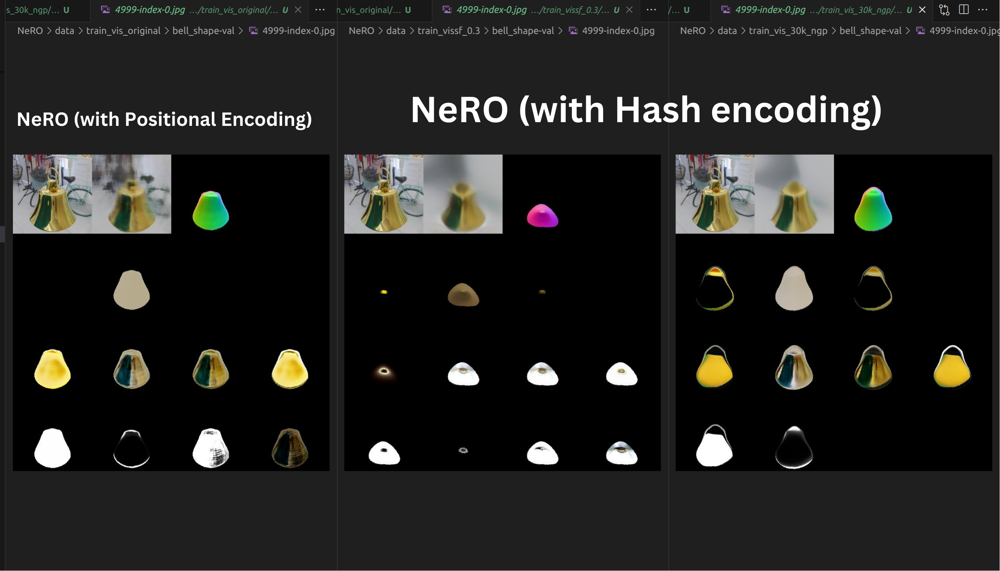

# Computer Vision Projects

## Custom CPU for ML Experiments

**Overview:** Built a custom CPU from scratch specifically for running machine learning experiments.

**Components Used:**

- **Motherboard**: [ASRock X670E TAICHI CARRARA](https://www.amazon.com/ASRock-X670E-Carrara-Processors-Motherboard/dp/B0BGPGH6WG)
- **CPU**: [AMD Ryzen 9 7000 series 16 core 32 thread](https://www.amazon.com/AMD-Ryzen-7950X3D-Hexadeca-core-Processor/dp/B0BTRH9MNS/ref=asc_df_B0BTRH9MNS/?tag=hyprod-20&linkCode=df0&hvadid=692875362841&hvpos=&hvnetw=g&hvrand=16695656210843621867&hvpone=&hvptwo=&hvqmt=&hvdev=c&hvdvcmdl=&hvlocint=&hvlocphy=9032188&hvtargid=pla-2281435182178&psc=1&mcid=5e8c836c59dd345693791cc7774e27b0&hvocijid=16695656210843621867-B0BTRH9MNS-&hvexpln=73&gad_source=1)
- **GPU**: [Nvidia GEFORCE RTX 4090 24GB](https://www.amazon.com/PNY-GeForce-RTXTM-4090-Triple-Graphics/dp/B0BHBTJ2X2/ref=asc_df_B0BHBTJ2X2/?tag=hyprod-20&linkCode=df0&hvadid=692875362841&hvpos=&hvnetw=g&hvrand=513373364324449578&hvpone=&hvptwo=&hvqmt=&hvdev=c&hvdvcmdl=&hvlocint=&hvlocphy=9032188&hvtargid=pla-2281435180498&psc=1&mcid=a87160cbd7673419ab1d1acbda190734&hvocijid=513373364324449578-B0BHBTJ2X2-&hvexpln=73&gad_source=1)
- **RAM**: [VENGEANCE LPX DDR5 64GB (2x32GB)](https://www.amazon.com/Corsair-VENGEANCE-3200MHz-Compatible-Computer/dp/B07Y4ZZ7LQ/ref=asc_df_B07Y4ZZ7LQ/?tag=hyprod-20&linkCode=df0&hvadid=692875362841&hvpos=&hvnetw=g&hvrand=2481200149637809416&hvpone=&hvptwo=&hvqmt=&hvdev=c&hvdvcmdl=&hvlocint=&hvlocphy=9032188&hvtargid=pla-2281435181178&mcid=236136ef8073388db43eb666b9e7b713&hvocijid=2481200149637809416-B07Y4ZZ7LQ-&hvexpln=73&gad_source=1&th=1)
- **Hard Drive**: [WD - BLACK SN850X 2TB](https://www.amazon.com/WD_BLACK-SN850X-Internal-Gaming-Solid/dp/B0B7CMZ3QH)
- **Power Supply**: [Gamemax 1300w](https://www.amazon.com/GAMEMAX-Addressable-Motherboard-105%C2%B0C-Rated-Capacitors/dp/B0BCKHHVYW/ref=asc_df_B0BCKHHVYW/?tag=hyprod-20&linkCode=df0&hvadid=692875362841&hvpos=&hvnetw=g&hvrand=3473661350933650431&hvpone=&hvptwo=&hvqmt=&hvdev=c&hvdvcmdl=&hvlocint=&hvlocphy=9032188&hvtargid=pla-2281435180058&psc=1&mcid=4916f6ee34c33a3bb00e04a893bb1e9a&hvocijid=3473661350933650431-B0BCKHHVYW-&hvexpln=73&gad_source=1)
- **Cooling System**: [Hyper 212 Halo](https://www.amazon.com/Cooler-Master-Aluminum-LGA1700-RR-S4KK-20PA-R1/dp/B0BRBWL38D/ref=asc_df_B0BRBWL38D/?tag=hyprod-20&linkCode=df0&hvadid=692875362841&hvpos=&hvnetw=g&hvrand=1568772745099818266&hvpone=&hvptwo=&hvqmt=&hvdev=c&hvdvcmdl=&hvlocint=&hvlocphy=9032188&hvtargid=pla-2281435178818&psc=1&mcid=d4fab3989c66355d8e89b9f1eea5a3a7&hvocijid=1568772745099818266-B0BRBWL38D-&hvexpln=73&gad_source=1)

  

    
  

  

    
  

  

    
  

  

    
  

## 3D Model Reconstruction and Visualization Platform

- **Transform Images to 3D Models**: Upload 2D images to generate high-fidelity 3D reconstructions with ease.
- **Point Cloud and Video Outputs**: Backend processes images to create both PLY files and MP4 videos for visualization.
- **Interactive 3D Viewer**: Render `.glb` models dynamically in a WebGL-powered single canvas.
- **User-Friendly Features**: Drag-and-drop uploads, real-time status monitoring, and options to download or share generated models.
- **Modern Tech Stack**: Built with Astro, React, FastAPI, Three.js, and Trimesh for optimal performance and scalability.
- **Scalable Hosting**: Deployed using AWS Amplify and Vercel to ensure reliability and speed.
- **Simplified Workflows**: Designed for an intuitive and hassle-free user experience in 3D reconstruction.

Discover the power of converting images into 3D visualizations like never before!
**[Try the PointCloud App Here](https://pointcloud.3-dready.com/)**  

## Evaluating Perceptual and Geometric Fidelity of Text-to-3D Models

- **Innovative Research**: Co-authored a publication for **CVPR 2025**, titled *"Evaluating Perceptual Fidelity of Text-to-3D Models"*.
- **Dual-Fidelity Assessment**: Developed evaluation frameworks focusing on both **perceptual fidelity** (alignment with human perception) and **geometric fidelity** (accuracy of 3D structures).
- **Multi-Modal Analysis**: Combined insights from **natural language processing**, **3D geometry**, and **computer vision** to establish comprehensive evaluation metrics.
- **Advanced Testing Frameworks**: Designed tools and workflows to measure structural and visual consistency in machine-generated 3D models.
- **Collaborative Effort**: Partnered with experts to push the boundaries of **text-to-3D synthesis** research.
- **Impactful Results**: Contributed to benchmarks that enhance model quality and bridge the gap between AI-generated 3D models and real-world expectations.

👉 **[Read the Paper](#)**

## 3D-Ready

**Overview:** The 3D-Ready application leverages a modern stack including React for the frontend and FastAPI for the backend, seamlessly integrated with various AWS services like Amplify, Lambda, S3, DynamoDB, and API Gateway.

**Deployment:** Utilizing AWS's robust infrastructure, the application ensures high availability and scalability, offering users an efficient and reliable experience for generating and viewing 3D models.

**Media Files and Links:**

  

- [Link full detailed architecture](3d-ready.md)
- [Link to 3D ready](https://3-dready.com/)

## Experiment : Gaussian Splatting using Acezero

**Overview:** The goal was to experiment with camera calibration techniques for Gaussian splatting. I developed a data loader script to convert Acezero’s camera pose estimation and point cloud output into a format suitable for Gaussian splatting. I precisely handled homogeneous matrices to ensure accurate data transformation and alignment.

**Media Files and Links:**

<iframe width="560" height="315" src="https://www.youtube.com/embed/t9Ci2fr699c?si=jL94IGkOq rXTXYTH&amp;start=2" title="YouTube video player" frameborder="0" allow="accelerometer; autoplay; clipboard-write; encrypted-media; gyroscope; picture-in-picture; web-share" referrerpolicy="strict-origin-when-cross-origin" allowfullscreen></iframe>

- [Link to Acezero gaussian Splatting Repository (now private)](https://github.com/3DReady/gaussian-splatting.git)

## Experiment : Efficient NeRO 

**Overview:** The goal is to leverage Hash encoding (like InstantNGP) for geometry reconstrcution to achieve faster 3D representations of reflective objects.

**Technical Approach:** -

- Python: For scripting, data processing, and automation of the pipeline.
- PyTorch: As the deep learning framework to implement and train the NeRO model.
- CUDA: For GPU acceleration to enhance processing efficiency and speed.

**Media Files and Links:**

  

- [Link to Modified-NeRO Repository](https://github.com/msam13/NeRO-HashEncoding)

## Experiment : Gaussian Surfels

**Overview:** This project involves experimenting with Gaussian Surfels

**Media Files and Links:**

<iframe width="560" height="315" src="https://www.youtube.com/embed/z2SJjj3Ym4A?si=u3oE0bCJ30jPdXwj" title="YouTube video player" frameborder="0" allow="accelerometer; autoplay; clipboard-write; encrypted-media; gyroscope; picture-in-picture; web-share" referrerpolicy="strict-origin-when-cross-origin" allowfullscreen></iframe>

<!-- 
## Experiment : Scaffold-GS

**Overview:** This project involves experimenting with Scaffold Gaussian Splatting

**Media Files and Links:**

<iframe width="560" height="315" src="https://www.youtube.com/embed/z2SJjj3Ym4A?si=u3oE0bCJ30jPdXwj" title="YouTube video player" frameborder="0" allow="accelerometer; autoplay; clipboard-write; encrypted-media; gyroscope; picture-in-picture; web-share" referrerpolicy="strict-origin-when-cross-origin" allowfullscreen></iframe> -->

## Experiment : MVSplat

**Overview:** This project involves experimenting with MVSplat

**Media Files and Links:**

<iframe width="560" height="315" src="https://www.youtube.com/embed/7GVez62iX9I?si=dhYzR2_5qQA-8P2h" title="YouTube video player" frameborder="0" allow="accelerometer; autoplay; clipboard-write; encrypted-media; gyroscope; picture-in-picture; web-share" referrerpolicy="strict-origin-when-cross-origin" allowfullscreen></iframe>

## Experiment : NeRO Bell

**Overview:** This project involves experimenting with NeRO (Neural Geometry and BRDF Reconstruction of Reflective Objects from Multiview Images) to create a high-quality 3D model of a bell. The goal is to leverage NeRO's advanced neural geometry and BRDF (Bidirectional Reflectance Distribution Function) reconstruction techniques to achieve precise and realistic 3D representations of reflective objects.

**Technical Approach:** -

- NeRO: For neural geometry and BRDF reconstruction from multiview images.
- Python: For scripting, data processing, and automation of the pipeline.
- PyTorch: As the deep learning framework to implement and train the NeRO model.
- CUDA: For GPU acceleration to enhance processing efficiency and speed.
- Blender : For Rendering

<iframe width="560" height="315" src="https://www.youtube.com/embed/6TdkTVGHfC8?si=N-i4y1BwlmY7pbmo" title="YouTube video player" frameborder="0" allow="accelerometer; autoplay; clipboard-write; encrypted-media; gyroscope; picture-in-picture; web-share" referrerpolicy="strict-origin-when-cross-origin" allowfullscreen></iframe>

## Experiment : NeRF Fox

**Overview:** This project creating a Neural Radiance Field (NeRF) of a fox using instant NGP. The result is a high-fidelity 3D representation of the fox that can be rendered from various viewpoints.

**Technical Approach:** -

- instant NGP: For generating the NeRF.
- Python: For scripting and automation.
- CUDA: For GPU acceleration.

**Media Files and Links:**

<iframe width="560" height="315" src="https://www.youtube.com/embed/nDbLZIRgzNE?si=YA8Fk6nYM_gUgNSs" title="YouTube video player" frameborder="0" allow="accelerometer; autoplay; clipboard-write; encrypted-media; gyroscope; picture-in-picture; web-share" referrerpolicy="strict-origin-when-cross-origin" allowfullscreen></iframe>

## Experiment : Gaussian Splatting

**Overview:** This project involves creating a high-fidelity 3D representation of a landscape scene using Gaussian splatting. The result is a detailed and visually appealing 3D model that can be viewed from multiple perspectives.

**Technical Approach:**

- Gaussian Splatting: For generating the 3D model.
- Python: For scripting and automation.
- CUDA: For GPU acceleration.

**Media Files and Links:**

<iframe width="560" height="315" src="https://www.youtube.com/embed/rT_ksIkZR_0?si=g9jbumoC0X77yuNE" title="YouTube video player" frameborder="0" allow="accelerometer; autoplay; clipboard-write; encrypted-media; gyroscope; picture-in-picture; web-share" referrerpolicy="strict-origin-when-cross-origin" allowfullscreen></iframe>

## 2D Image Fitting Using KAN (Kolmogorov–Arnold Networks)

**Overview:** This project involves fitting 2D images (MNIST) using Kolmogorov–Arnold Networks (KAN) to improve image representation and reconstruction.

**Technical Approach:** The project utilizes Kolmogorov–Arnold Networks for effective 2D image fitting, leveraging advanced mathematical techniques to achieve high accuracy in image reconstruction.

**Media Files and Links:**

- [Link to 2D Image Fitting Using KAN Repository](https://github.com/msam13/Kan-ImageFitting)

## Structure from Motion

**Overview:** This project focuses on the structure from motion (SfM) technique using Python, Numpy, OpenCV, and GPU to reconstruct 3D structures from 2D images.

**Technical Approach:** The SfM technique is implemented using Python and libraries like Numpy and OpenCV. GPU acceleration is utilized to enhance computational efficiency.

**Media Files and Links:**

- COLAMP SMF
<iframe width="560" height="315" src="https://www.youtube.com/embed/AKy6pkxb6Zc?si=RB3QLBeCKmMY_qtY" title="YouTube video player" frameborder="0" allow="accelerometer; autoplay; clipboard-write; encrypted-media; gyroscope; picture-in-picture; web-share" referrerpolicy="strict-origin-when-cross-origin" allowfullscreen></iframe>

- COLMAP POINTCLOUD
<iframe width="560" height="315" src="https://www.youtube.com/embed/5iAL4NZKW_0?si=LskwNymogwJCvmCb" title="YouTube video player" frameborder="0" allow="accelerometer; autoplay; clipboard-write; encrypted-media; gyroscope; picture-in-picture; web-share" referrerpolicy="strict-origin-when-cross-origin" allowfullscreen></iframe>

## Image Classifier Using PyTorch

**Overview:** Rebuilt the OG PyTorch-based image classification project to accurately categorize images into predefined classes, demonstrating proficiency in deep learning and computer vision.

**Technical Approach:** Implemented a Convolutional Neural Network (CNN) with multiple convolutional and fully connected layers, utilizing ReLU activation, max pooling, and backpropagation for training, while leveraging the Stochastic Gradient Descent (SGD) optimizer and cross-entropy loss for efficient learning. Model trained on CIFAR10 datatset.

**Media Files and Links:**

- [Link to Digit Classifier Using PyTorch Repository](https://github.com/msam13/CNNImageClassifier)

  

    
  

