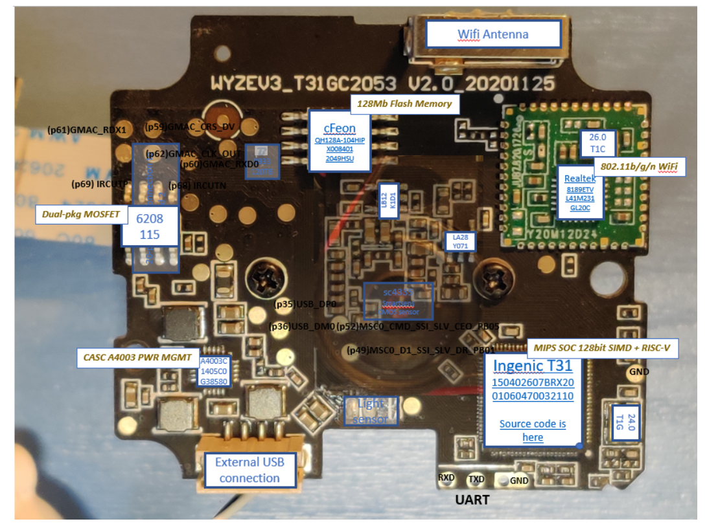

# Cyber Security Projects

## 1. Wyze Cam Firmware Analysis

**Overview:** This project involves the analysis of the Wyze Cam firmware to identify potential vulnerabilities and weaknesses. The goal is to improve the security of IoT devices by understanding their firmware architecture and pinpointing areas that need enhancement.

**Technical Approach:** The analysis was performed using various reverse engineering tools and techniques. The firmware was dissected to uncover its inner workings and identify any exploitable vulnerabilities.

**Media Files and Links:**

  

- [Github Repository](https://github.com/msam13/wyze-cam-firmware-analysis)
- [Project Report](Wyze _Cam_Final_Report.pdf)

## 2. FreeBSD RootKit Recon

**Overview:** This project focuses on identifying and analyzing rootkits in the FreeBSD operating system. The aim is to enhance system security by detecting and understanding rootkit behaviors and developing strategies to mitigate their impact.

**Technical Approach:** The project involves the use of various rootkit detection tools and manual analysis techniques. The behavior of different rootkits was studied to develop a comprehensive understanding of their functioning.

**Media Files and Links:**

- [FreeBSD RootKit Recon Repository](https://github.com/msam13/freeBSD_RootKitRecon)

## 3. SOC Analysis

**Overview:** This project is centered around Security Operations Center (SOC) analysis. It involves monitoring, detecting, and responding to cybersecurity threats within an organization. The project aims to improve incident response strategies and enhance overall security posture.

**Technical Approach:** The SOC analysis was performed using various security information and event management (SIEM) tools. Data from multiple sources was collected and analyzed to detect potential security incidents and respond accordingly.

**Media Files and Links:**

- [Link to SOC Analysis Report](https://github.com/msam13/samridhamurali.github.io/blob/main/soc_Report.pdf)

## 4. Penetration Testing

**Overview:** This project involves conducting penetration tests to identify and exploit vulnerabilities in various systems and applications. The goal is to improve security by discovering and addressing potential weaknesses before they can be exploited by malicious actors.

**Technical Approach:** Various penetration testing tools and methodologies were used to perform the tests. The project involved both automated and manual testing techniques to thoroughly assess the security of the target systems.

**Media Files and Links:**

- [Link to Penetration Testing Report](#)

## 5. Cloud Security - AWS

**Overview:** This project focuses on securing cloud infrastructure hosted on Amazon Web Services (AWS). The aim is to protect sensitive data and ensure the integrity and availability of cloud resources by implementing robust security measures.

**Technical Approach:** Various AWS security services and best practices were employed to secure the cloud environment. The project involved configuring security groups, IAM roles, encryption, and monitoring services to protect the cloud infrastructure.

**Media Files and Links:**

- [Link to Cloud Security - AWS Report](https://github.com/msam13/samridhamurali.github.io/blob/main/cloudsec_report.pdf)
