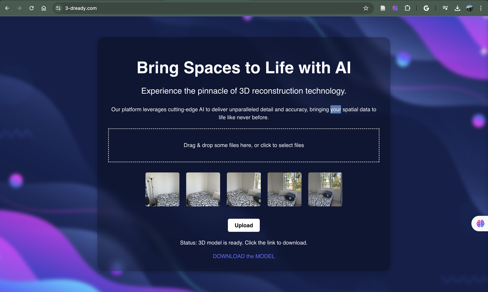
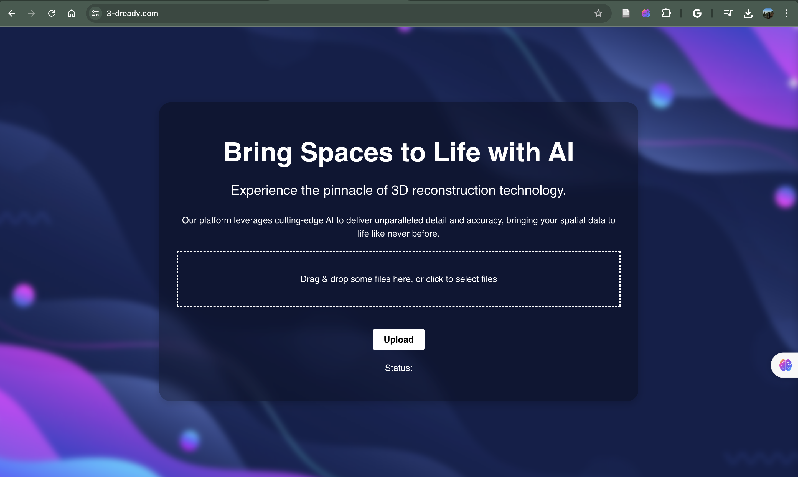

## About Me

  

    Hello! I'm Samridha Murali. Welcome to my portfolio. On the right is a photo of me from March 2024, when I visited San Fransico for the first time. I loved the Californian Energy, so post graduation I moved to THE SILLICON VALLEY, worked for <a href="https://scale.com/">ScaleAI</a> and co-founded <a href="http://3-dready.com/">3D-Ready</a>. A little into my past, I graduated from <a href="https://umd.edu/">Univesity of Maryland</a> with a Master's degree in Engineering (Cyber Security and Software Engineering). In University of Maryland, I worked for <a href="https://www.cattlab.umd.edu/">CATT lab</a>. During Pandemic I did a lot, including an awesome intership at <a href="https://www.honeywell.com/us/en">Honeywell</a> & <a href="https://www.hpe.com/us/en/home.html">HPE</a>, published a <a href="https://www.ijeat.org/wp-content/uploads/papers/v10i1/A17981010120.pdf"> Paper</a>, and also finished my Bachelor's degree in Computer Science and Engineer at <a href="https://www.manipal.edu/mit.html">Manipal Institute of Technology</a>. I build with LOVE ❤️ 
    <!-- Additional About Me content can go here. -->
  

  

    
  

## Projects

**Computer Vision** - [Link to Computer Vision Projects page](computer_vision_ml_projects.md)

**CyberSecurity** - [Link to Cyber Security Projects page](cyber_security_projects.md)

<!-- ------------------------------------------------------------------------------------>

  

    <iframe width="100%" height="500" src="https://www.youtube.com/embed/5iAL4NZKW_0?si=nGP25-Z6RHoq-1Bx" title="YouTube video player" frameborder="0" allow="accelerometer; autoplay; clipboard-write; encrypted-media; gyroscope; picture-in-picture; web-share" referrerpolicy="strict-origin-when-cross-origin" allowfullscreen></iframe>
  

  

    <iframe width="100%" height="500" src="https://www.youtube.com/embed/nDbLZIRgzNE?si=9IpaO6kJLpT9WyiP" title="YouTube video player" frameborder="0" allow="accelerometer; autoplay; clipboard-write; encrypted-media; gyroscope; picture-in-picture; web-share" referrerpolicy="strict-origin-when-cross-origin" allowfullscreen></iframe>
  

  

    <iframe width="100%" height="500" src="https://www.youtube.com/embed/AKy6pkxb6Zc?si=PonKSOAenogWhGeu" title="YouTube video player" frameborder="0" allow="accelerometer; autoplay; clipboard-write; encrypted-media; gyroscope; picture-in-picture; web-share" referrerpolicy="strict-origin-when-cross-origin" allowfullscreen></iframe>
  

  

    <iframe width="100%" height="500" src="https://www.youtube.com/embed/6TdkTVGHfC8?si=DmqPyfrNF2aKKg-O" title="YouTube video player" frameborder="0" allow="accelerometer; autoplay; clipboard-write; encrypted-media; gyroscope; picture-in-picture; web-share" referrerpolicy="strict-origin-when-cross-origin" allowfullscreen></iframe>
  

  

    
  

  

    
  

  

    
  

 

   
   
   
   
   
   
   

<!-- ------------------------------------------------------------------------------------>

## Blogs

Explore detailed analyses and insights on various cyber attacks that occurred in 2021 and 2022.

[Read more on the Blog page](blogs.md).

## Products

Developed a complete end-to-end web application and Server infrasture (Hybrid cloud) for delivering high-fidelity 3D models (3D reconstruction engine based on implicit Neural representation) of house interiors for the real estate industry.

  

    
  

  

    
  

Get 3D model of your room at <https://3-dready.com/>
[Link to Architecture](3d-ready.md)

## Publications

My research on knowledge representation, an emerging field in LLM, ML , Big Data, Semantic Web, and Data Mining.

  

    
  

[Read more on the Publications page](publications.md).

## Links

[LinkedIn](https://www.linkedin.com/in/m-samridha/) · [Twitter](https://x.com/murali_samridha) · [Email](mailto:msamridha16@gmail.com) · [Resume](https://docs.google.com/document/d/16qNNTf1iqsf-tbuVGM3cxHulZHWiCrAaN-g9qMXh0Tc/edit?usp=sharing)
