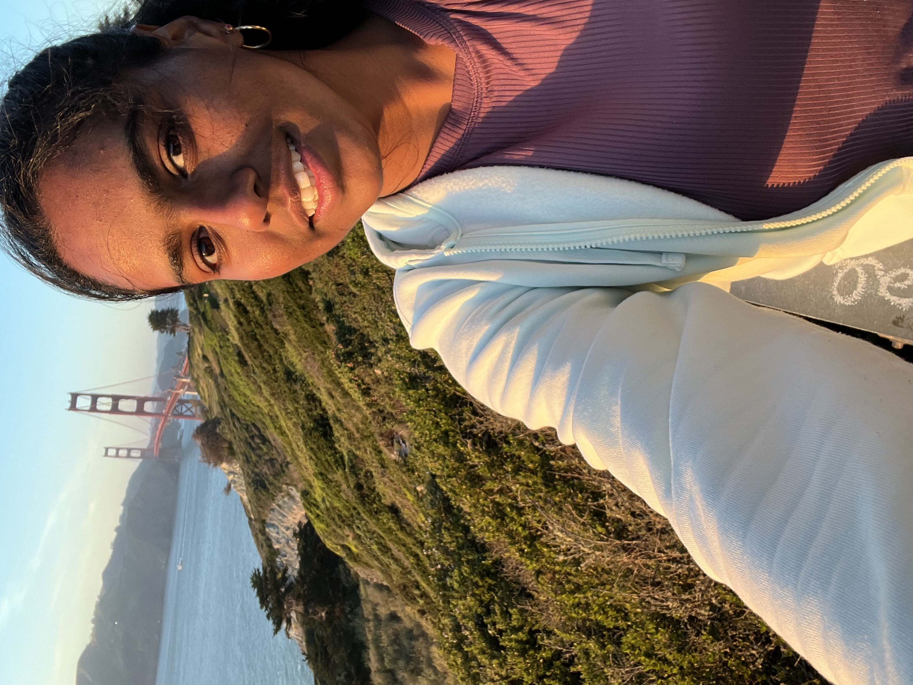

<!-- Google tag (gtag.js) -->

## About Me

  

  Hello! I’m Samridha, and this is my personal portfolio. I currently work on machine learning model and algorithm evaluation at Apple, with a focus on video-based computer vision. On a side note, I’m very interested in robotics. I explore advances in embodied AI whenever I get the chance.
    <!-- Additional About Me content can go here. -->
  

  

    
  

## Projects

**Computer Vision** - [Link to Computer Vision Projects page](computer_vision_ml_projects.md)

**CyberSecurity** - [Link to Cyber Security Projects page](cyber_security_projects.md)

<!-- ------------------------------------------------------------------------------------>
## Research

- Awarded Travel Grant for NeurIPS 2024
- Extended abstract [evaluating the geometric consistency of text-to-3D models](Abstract.pdf) accepted WiML NeurIPS workshop 2024
- Accepted as a reviewer for the WiML NeurIPS workshop 2024
- Submitted an extended abstract on [evaluating the geometric consistency of text-to-3D models](Abstract.pdf)

## Links

[LinkedIn](https://www.linkedin.com/in/m-samridha/) · [Twitter](https://x.com/murali_samridha) · [Email](mailto:msamridha16@gmail.com) · 
